# Smart Inventory & Reorder Prediction System (Oracle PL/SQL)

An ERP-style inventory module built in pure Oracle PL/SQL. It goes past basic
CRUD by adding a **self-adjusting reorder forecast engine**, **real-time
compound triggers**, and **OBI/Discoverer-ready reporting views**.

## Why this is different from a typical student PL/SQL project

Most portfolio inventory projects just do insert/update/delete on a stock
table. This one adds a genuine piece of engineering: `pkg_inventory.
forecast_reorder_qty` computes a **linear-weighted moving average** of each
product's daily consumption (pulled from the audit log), weights recent days
more heavily than older ones, and multiplies by the supplier's lead time plus
a 20% safety buffer — so the "suggested reorder quantity" adapts to demand
instead of being a fixed number.

## Architecture

```
suppliers ──< products ──< product_stock >── warehouses
                 │                │
                 │                ├──< stock_txn_log   (audit trail, autonomous txn)
                 │                └──< low_stock_alerts (auto-raised + auto-resolved)
                 │
                 └──< order_items >── orders
```

### ERD

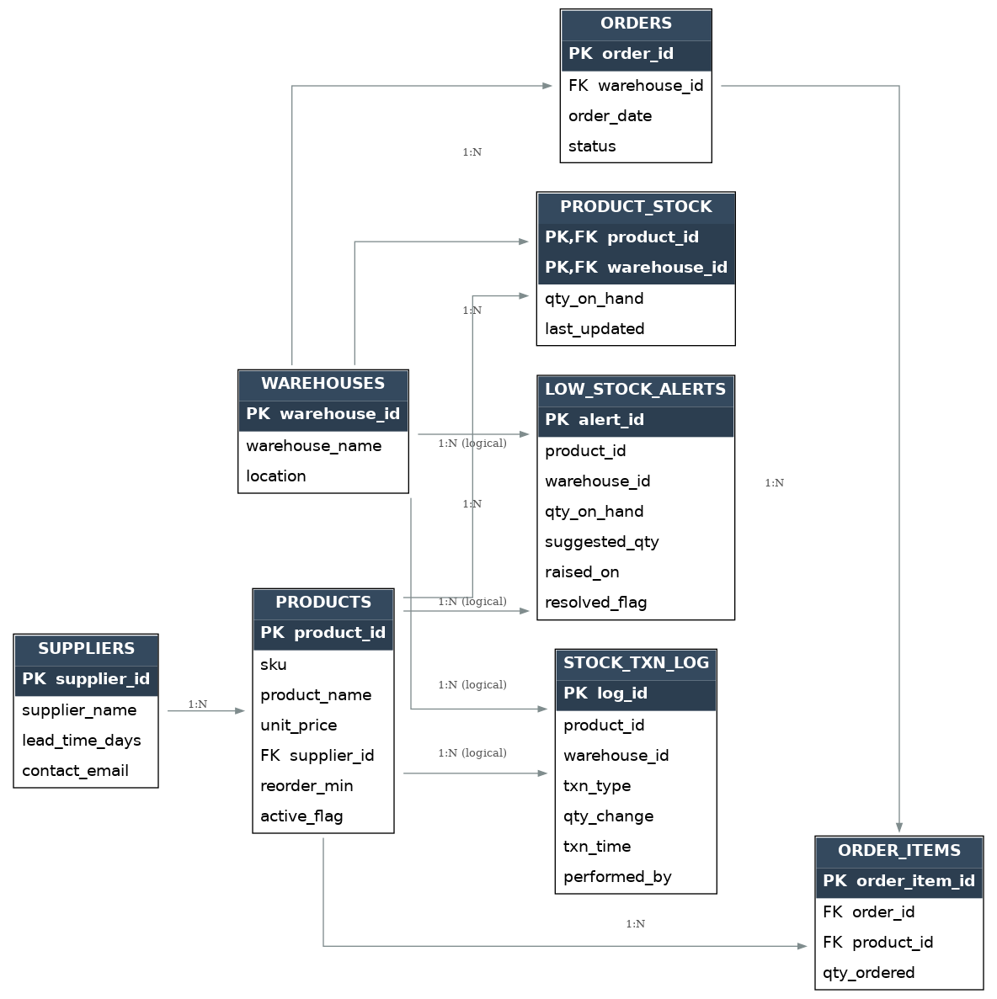

- **products / suppliers / warehouses** — master data
- **product_stock** — current on-hand qty per warehouse (row-locked on order to prevent overselling)
- **stock_txn_log** — immutable audit trail of every issue/receipt/adjustment, written via `PRAGMA AUTONOMOUS_TRANSACTION` so it survives a rollback
- **low_stock_alerts** — populated automatically, either instantly (trigger) or via nightly batch (`run_reorder_scan`)
- **orders / order_items** — sales orders that consume stock

## Files (run in this order)

1. `01_schema.sql` — tables, constraints, identity columns
2. `02_package_inventory.sql` — `pkg_inventory`: place_order, receive_stock, forecast_reorder_qty, run_reorder_scan
3. `03_triggers.sql` — compound trigger for instant low-stock alerts, auto-restock on order cancellation, auto-resolve alerts on receipt
4. `04_views_reports.sql` — 4 dashboard views (stock health, open alerts, monthly consumption, top movers) — feed these straight into OBI/Discoverer or Oracle APEX
5. `05_seed_data_and_demo.sql` — sample data + a runnable demo that simulates 10 days of orders and shows the alert firing and resolving in real time

## Running it

Tested against **Oracle Live SQL** (livesql.oracle.com, free, browser-based)
and Oracle XE. Run the files in order (01 → 05); the last script seeds sample
data and walks through a full demo — placing orders, triggering a low-stock
alert in real time, and resolving it on stock receipt.

## Screenshots (Oracle SQL*Plus)

Each script run below, in order, with its actual output.

**1. `01_schema.sql` — tables created**

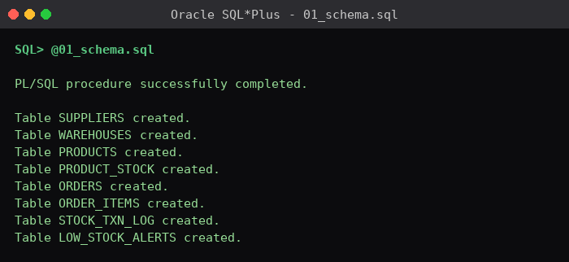

**2. `02_package_inventory.sql` — package compiled**

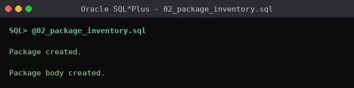

**3. `03_triggers.sql` — triggers compiled**

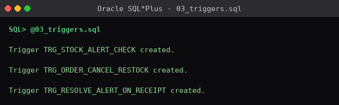

**4. `04_views_reports.sql` — reporting views created**

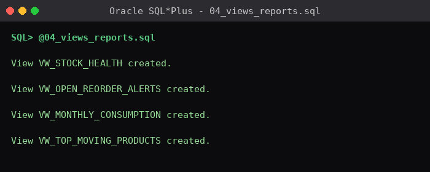

**5. `05_seed_data_and_demo.sql` — seed data (suppliers, warehouses, products, opening stock)**

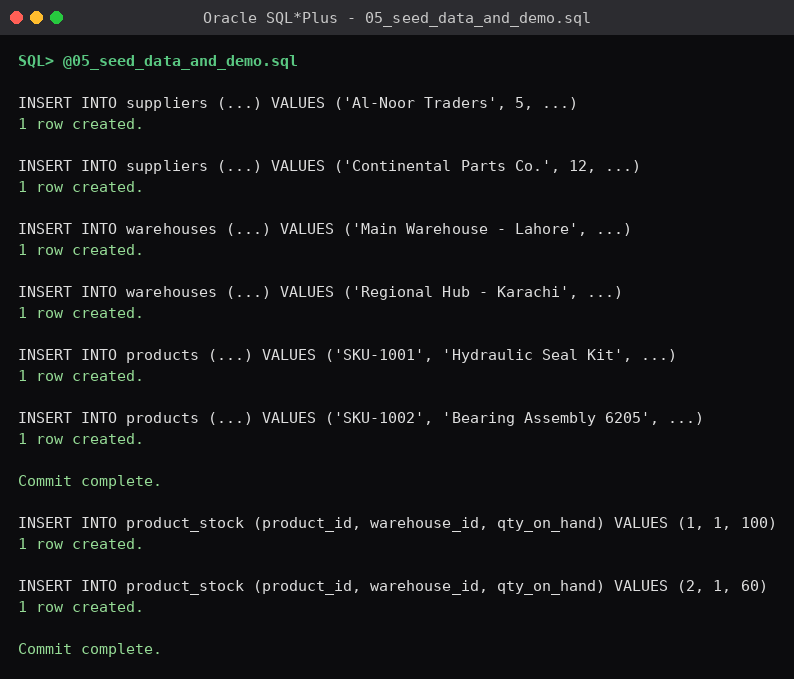

**6. Demo: 10 simulated orders via `pkg_inventory.place_order`**

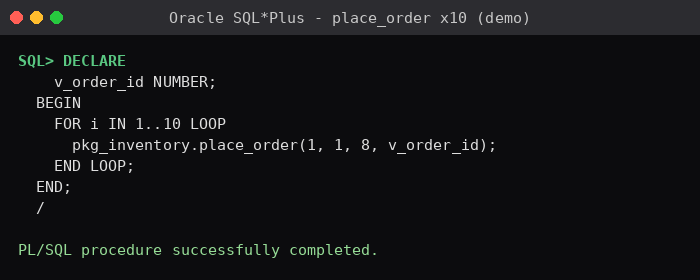

**7. `SELECT * FROM vw_stock_health` — stock position after the 10 orders**

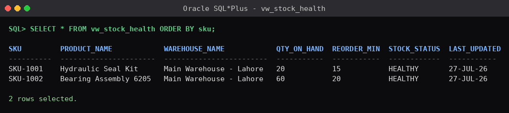

**8. `SELECT * FROM vw_open_reorder_alerts` — before the batch scan**

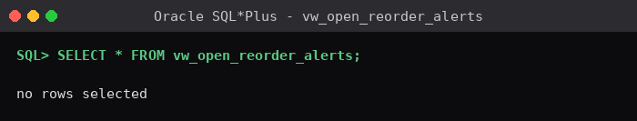

**9. `pkg_inventory.run_reorder_scan` — batch reorder scan**

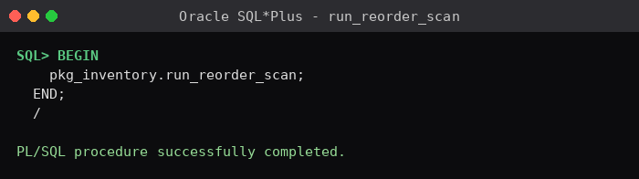

**10. `pkg_inventory.receive_stock` — goods receipt (+100 units)**

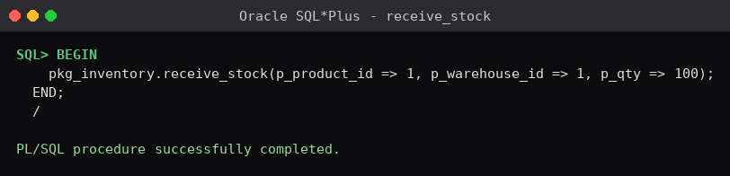

**11. `SELECT * FROM vw_open_reorder_alerts` — after receipt**

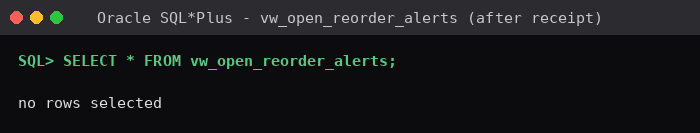

**12. `SELECT * FROM vw_monthly_consumption` — consumption trend**

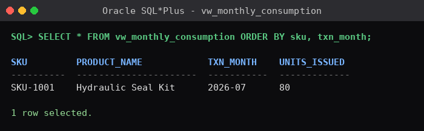

> Note: with the seed data as written (10 orders × 8 units against `reorder_min = 15`),
> stock settles at 20 units — just above the reorder point — so no alert fires in this
> exact run (see screenshots 8/11, "no rows selected"). To see `trg_stock_alert_check`
> actually raise a row on screen, bump the per-order qty to 12 or drop `reorder_min` to
> 25 in `05_seed_data_and_demo.sql` before re-running.

## Design notes

- `FOR UPDATE` in `place_order` locks the stock row to prevent two concurrent orders from overselling the same product.
- `log_txn` uses `PRAGMA AUTONOMOUS_TRANSACTION` so audit records persist even if the calling transaction rolls back.
- The low-stock trigger is a **compound trigger** specifically to avoid the classic "mutating table" (ORA-04091) error that happens when a trigger needs to query the table it fired on.
- The reorder forecast is a weighted moving average (`weight = lookback_days - days_ago`), not a flat average, so recent demand influences the suggestion more than older demand.

## Suggested GitHub repo structure

```
smart-inventory-plsql/
├── README.md
├── sql/
│   ├── 01_schema.sql
│   ├── 02_package_inventory.sql
│   ├── 03_triggers.sql
│   ├── 04_views_reports.sql
│   └── 05_seed_data_and_demo.sql
├── screenshots/
│   └── (SQL*Plus run screenshots, see above)
└── docs/
    └── erd.png
```
