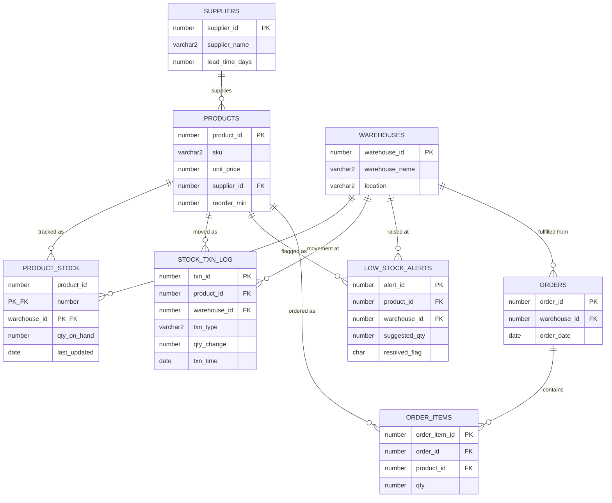

<div align="center">

# 📦 Smart Inventory &amp; Reorder Prediction System

### An ERP-style inventory module in **pure Oracle PL/SQL** — with a self-adjusting reorder forecast engine, real-time compound triggers, and BI-ready reporting views.

<br />

[](https://livesql.oracle.com/)
[](https://docs.oracle.com/en/database/oracle/oracle-database/21/lnpls/index.html)
[](#-the-headline-feature-a-real-forecast-engine)

[](#-screenshots-oracle-sqlplus)
[-blue?style=flat-square)](#-files-run-in-this-order)
[](LICENSE)

<br />

**[Quick Start](#-running-it) · [Architecture](#-architecture) · [Forecast Engine](#-the-headline-feature-a-real-forecast-engine) · [Screenshots](#-screenshots-oracle-sqlplus)**

</div>

---

> ### 🏭 Looking for the full enterprise version?
> This repo is the **original, focused PL/SQL build**. It was later re-engineered into a complete Oracle Developer Suite showcase — **RBAC, a compliance-grade audit trail (SCD Type 2), documented performance tuning, ETL migration, `DBMS_SCHEDULER` jobs, and Forms / Reports / APEX specs** — over at:
>
> ### 👉 **[itshussainsprojects/ERP-System](https://github.com/itshussainsprojects/ERP-System)**
>
> Start there if you want the "end-to-end Oracle ERP" story. Stay here for a clean, self-contained PL/SQL forecasting project.

---

## 📖 Table of contents

- [What this is](#-what-this-is)
- [Why it's different from a typical student PL/SQL project](#-why-its-different-from-a-typical-student-plsql-project)
- [The headline feature: a real forecast engine](#-the-headline-feature-a-real-forecast-engine)
- [Architecture](#-architecture)
- [Files (run in this order)](#-files-run-in-this-order)
- [Running it](#-running-it)
- [Screenshots (Oracle SQL*Plus)](#-screenshots-oracle-sqlplus)
- [Reporting views](#-reporting-views)
- [Design notes](#-design-notes)
- [Repo layout](#-repo-layout)

---

## 🎯 What this is

An inventory and stock-control module built entirely in Oracle PL/SQL — no external
analytics tool, no application server. It tracks on-hand stock per warehouse,
consumes it through a governed `place_order` API that can't oversell, logs every
movement to an immutable ledger, and **predicts how much to reorder** from each
product's actual consumption history.

| | |
|---|---|
| **Language** | Oracle PL/SQL (packages, compound triggers) |
| **Tested on** | Oracle Live SQL (browser, free) &amp; Oracle XE |
| **Scripts** | 5 — run `01` → `05`, the last one seeds data and runs a full demo |
| **External deps** | none |

---

## 🧩 Why it's different from a typical student PL/SQL project

Most portfolio inventory projects just do insert / update / delete on a stock table.
This one adds genuine engineering:

| Piece | What it does |
|---|---|
| 🔮 **Forecast engine** | `pkg_inventory.forecast_reorder_qty` — a **linear-weighted moving average** of each product's daily consumption, weighting recent days more heavily, × supplier lead time + 20% safety buffer. The suggested reorder quantity *adapts to demand* instead of being a fixed number. |
| ⚡ **Compound triggers** | `trg_stock_alert_check` raises a low-stock alert the instant stock drops to the reorder point — written as a *compound* trigger specifically to avoid the classic `ORA-04091` mutating-table error a naive row trigger would hit. |
| 🔒 **Row-locked write path** | `place_order` does `SELECT ... FOR UPDATE` on the stock row, so two concurrent orders can't both read stale stock and oversell. |
| 📝 **Autonomous-transaction ledger** | `log_txn` uses `PRAGMA AUTONOMOUS_TRANSACTION` so audit records persist even if the calling transaction rolls back. |
| 📊 **BI-ready views** | Four dashboard views (stock health, open alerts, monthly consumption, top movers) ready to feed straight into Oracle Discoverer / OBI / APEX. |

---

## 🔮 The headline feature: a real forecast engine

```
forecast_reorder_qty(product, warehouse, lookback_days = 30)
```

1. Pull every `ISSUE` transaction for that product/warehouse from `stock_txn_log`
   over the last *N* days.
2. Bucket by day, then compute a **weighted** average — `weight = lookback_days - days_ago`,
   so yesterday counts for more than three weeks ago.
3. Multiply the weighted daily demand by the supplier's `lead_time_days`.
4. Add a 20% safety buffer.

The result is a reorder quantity that tracks whether demand is rising or falling,
computed entirely in PL/SQL. `run_reorder_scan` runs it for every product/warehouse
pair and raises alerts in one pass.

---

## 🏗 Architecture

```
suppliers ──< products ──< product_stock >── warehouses
                 │                │
                 │                ├──< stock_txn_log     (immutable audit trail, autonomous txn)
                 │                └──< low_stock_alerts   (auto-raised + auto-resolved)
                 │
                 └──< order_items >── orders
```

### ER diagram



> A rendered PNG is also in [`docs/erd.png`](docs/erd.png).

### What each table does

- **products / suppliers / warehouses** — master data.
- **product_stock** — current on-hand qty per warehouse; the row is locked (`FOR UPDATE`) on order to prevent overselling.
- **stock_txn_log** — immutable audit trail of every issue / receipt / adjustment, written via `PRAGMA AUTONOMOUS_TRANSACTION` so it survives a rollback.
- **low_stock_alerts** — populated automatically, either instantly (trigger) or via the nightly batch (`run_reorder_scan`), and auto-resolved on stock receipt.
- **orders / order_items** — sales orders that consume stock.

---

## 📂 Files (run in this order)

| # | File | What it creates |
|:--:|---|---|
| 1 | [`01_schema.sql`](01_schema.sql) | Tables, constraints, identity columns |
| 2 | [`02_package_inventory.sql`](02_package_inventory.sql) | `pkg_inventory` — `place_order`, `receive_stock`, `forecast_reorder_qty`, `run_reorder_scan` |
| 3 | [`03_triggers.sql`](03_triggers.sql) | Compound trigger for instant low-stock alerts, auto-restock on order cancellation, auto-resolve alerts on receipt |
| 4 | [`04_views_reports.sql`](04_views_reports.sql) | Four dashboard views — feed straight into OBI / Discoverer / APEX |
| 5 | [`05_seed_data_and_demo.sql`](05_seed_data_and_demo.sql) | Sample data + a runnable demo: 10 simulated days of orders, a live alert firing, then resolving on receipt |

---

## ▶️ Running it

Tested against **[Oracle Live SQL](https://livesql.oracle.com/)** (free, browser-based) and Oracle XE.

```sql
-- run the files in order, 01 → 05
@01_schema.sql
@02_package_inventory.sql
@03_triggers.sql
@04_views_reports.sql
@05_seed_data_and_demo.sql   -- seeds data and walks through the full demo
```

The last script seeds sample data and walks through a complete demo — placing
orders, triggering a low-stock alert in real time, and resolving it on stock receipt.

---

## 📸 Screenshots (Oracle SQL*Plus)

Each script run below, in order, with its actual output.

| Step | Screenshot |
|---|---|
| **1.** `01_schema.sql` — tables created |  |
| **2.** `02_package_inventory.sql` — package compiled |  |
| **3.** `03_triggers.sql` — triggers compiled |  |
| **4.** `04_views_reports.sql` — reporting views created |  |
| **5.** `05_seed_data_and_demo.sql` — seed data |  |
| **6.** Demo: 10 orders via `pkg_inventory.place_order` |  |
| **7.** `SELECT * FROM vw_stock_health` — position after the orders |  |
| **8.** `vw_open_reorder_alerts` — before the batch scan |  |
| **9.** `pkg_inventory.run_reorder_scan` — batch reorder scan |  |
| **10.** `pkg_inventory.receive_stock` — goods receipt (+100) |  |
| **11.** `vw_open_reorder_alerts` — after receipt |  |
| **12.** `vw_monthly_consumption` — consumption trend |  |

> ℹ️ **Note on this run:** with the seed data as written (10 orders × 8 units against `reorder_min = 15`),
> stock settles at 20 units — just above the reorder point — so no alert fires in this exact run
> (screenshots 8 / 11 show "no rows selected"). To watch `trg_stock_alert_check` raise a row on
> screen, bump the per-order qty to **12**, or drop `reorder_min` to **25** in
> `05_seed_data_and_demo.sql` before re-running.

---

## 📊 Reporting views

All four are in [`04_views_reports.sql`](04_views_reports.sql) and are shaped for BI tools:

| View | Purpose |
|---|---|
| `vw_stock_health` | Current stock position across all warehouses, with an `OUT OF STOCK` / `LOW STOCK` / `HEALTHY` status flag |
| `vw_open_reorder_alerts` | Unresolved reorder alerts joined to supplier + lead-time info |
| `vw_monthly_consumption` | Units issued per product per month — ready for a line chart |
| `vw_top_moving_products` | Top 10 fastest-moving products in the last 30 days |

---

## 🔧 Design notes

- **`FOR UPDATE` in `place_order`** locks the stock row so two concurrent orders can't oversell the same product.
- **`log_txn` is `PRAGMA AUTONOMOUS_TRANSACTION`** so audit records persist even if the calling transaction rolls back.
- **The low-stock trigger is a compound trigger** specifically to avoid the classic mutating-table error (`ORA-04091`) that hits when a trigger needs to query the table it fired on.
- **The reorder forecast is a weighted moving average** (`weight = lookback_days - days_ago`), not a flat average — recent demand influences the suggestion more than older demand.

---

## 📁 Repo layout

```
smart-inventory-plsql/
├── README.md                   ← you are here
├── LICENSE
├── 01_schema.sql
├── 02_package_inventory.sql
├── 03_triggers.sql
├── 04_views_reports.sql
├── 05_seed_data_and_demo.sql
├── docs/
│   └── erd.png
└── screenshots/
    └── 01..12 — SQL*Plus run screenshots (see above)
```

---

<div align="center">
<sub>Built by <b>Hassan</b> · Oracle PL/SQL · &nbsp;·&nbsp; Full enterprise version → <a href="https://github.com/itshussainsprojects/ERP-System">ERP-System</a></sub>
</div>
